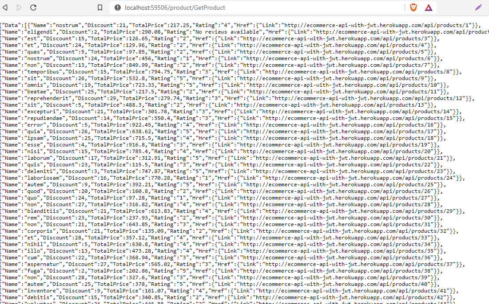

##### This project has not been developed following the best practices.However, you can visit the link below to see how I would architect my application. https://github.com/sudip571/Clean-Architecture-CQRS-MediatR-.NET-Core-Web-API-Application-setup


### Pre-Assignment Q&A 


###### 4. C# / SQL Server Question
***
A) By observing the structure of response I get from heroku API, I have designed the table like this to store data hourly.

  

B) If you click ***GetProduct*** button , it makes request to heroku API and saves the data to database table and also displays the response data.
You can observe the code in ***ProductController*** and ***ProductService*** class.





C) Since, we have to fetch data hourly we can use task scheduler like Hangfire. However, I have created windows service which runs every hour and fetch data from heroku api and stores data in database.
you can observe it in ***HerokuService*** project.


D) There are lots of tools out there like NLog,Log4Net,Elmah etc. However I have been using ***Serilog*** for logging.


###### 5. JavaScript/jQuery Question
***
If you click the ***Cick to generate form*** button , it generates the form based on the JSON you have provided.


###### 6. SQL Server Question
***
```SQL
select T2.customerId,c.Name,T2.Date,T2.Qty from Customers as c
inner join (
select customerId,Date,Qty from (
SELECT ROW_NUMBER() OVER (PARTITION BY customerId ORDER BY Date DESC) rownumber, *
    FROM CustomerOrders

)AS T1

WHERE rownumber <=2) as T2
on c.customerId =T2.customerId
```

The Expected result is shown below 


However, this is how we do it using LINQ 
``` LINQ
  Example
          var customerOrder = new List<CustomerrOrder>();
            var res = db.CustomerrOrders.GroupBy(x => x.Customerr.CustomerrId, (key, element) => element.OrderByDescending(x => x.Date).Take(2)).ToList();
            foreach (var item in res)
            {
                customerOrder.AddRange(item);                
            }
            var customer = db.Customerrs.ToList();
            var result = customer.Join(customerOrder, c => c.CustomerrId, i => i.Customerr.CustomerrId, (c, i) => new { Id = c.CustomerrId, Name = c.Name, Date = i.Date, Qty = i.Qty }).ToList();
            
```
Result


###### 1. Areas of Interest: Specify the tools that you have used for:
***
a) Web Development:   Visual Studio, Visual Studio code, NotePad++, GIT
 
b) Coding: C#, ASP.NET , .Net Core, Bootstrap, JQuery, JavaScript, VUE 3, HTML,CSS
 
c) Database: SQL Server ,PostgreSQL*
 
d) Data Analysis: Excel,HighCharts
 

###### 2. In an engineering project that you were involved, select the role(s) are you most likely to be involved in?
***

I would choose all those four points because more or less I have been involved in all those areas.


###### 3. Name the project that you were involved in and are most proud of? Why? What was your role?

I am proud of all those projects that I was involved in. I got to learn a lot of things from those projects and wherever I am and whatever skills I have today is  because of my involvement in those projects.


###### 7. Using python, write a program to define a class with attribute and function. Create object and call the function.
***
```python
class CovidPatient:
  
   patientCount = 0

   def __init__(self, name, age):
      self.name = name
      self.age = age
      CovidPatient.patientCount += 1
   
   def displayPatientCount(self):
     print "Total Covid Patient %d" % CovidPatient.patientCount

   def displayPatient(self):
      print "Name : ", self.name,  ", Age: ", self.age


p1 = CovidPatient("Ram", 35)
p2 = CovidPatient("Hari", 21)

p1.displayPatient()
p2.displayPatient()
p2.displayPatientCount()

```


###### 8. You have an existing system that you have to scale up in terms of both efficiency for existing clients and be capable to handle 100X number of clients. What are the steps that you would take?
***


For processing more request, server resources need to be increased and I believe we should consult with IT Department. 
And also, We should keep our application updated.We have to follow the right architectural pattern and best practices while designing and developing our application. We should keep updating the tools.Database should be properly designed and it is always better to hire dedicated database developer.
Our application should be properly tested before taking it to live.